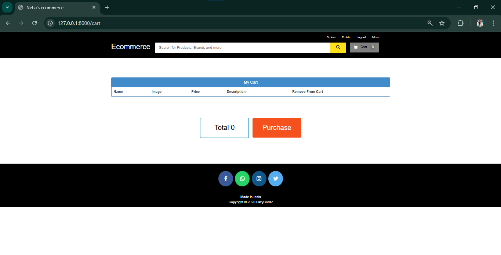

# ECOMMERCE


---

## Screenshots

### Admin Dashboard


### Customer Homepage


### Cart


### Track Orders


---

## FEATURES

### 👩‍💼 Customer
- Browse/search products without login.
- Add/remove products to cart without login.
- Requires login to place an order.
- Simulated payment process (no real transactions).
- View and track order status (Pending, Confirmed, Delivered).
- Download invoice.
- Submit feedback (even without login).

---

### 🧑‍💼 Admin
- Login via Django admin panel (`createsuperuser`).
- Dashboard with counts of users, products, and orders.
- Add/delete/edit products.
- Manage users and orders.
- Change order status.
- View customer feedback.

---

### 🔍 Additional Functionalities
- If a customer is deleted, their orders are also removed.
- Deleted products also remove associated orders automatically.
- Purchase action without cart items shows a warning.

---

## 🚀 How to Run This Project

### Prerequisites:
- Python 3.7.6
- Django 3.0.5

### Install Dependencies:
```bash
pip install django==3.0.5
pip install django-widget-tweaks
pip install xhtml2pdf
